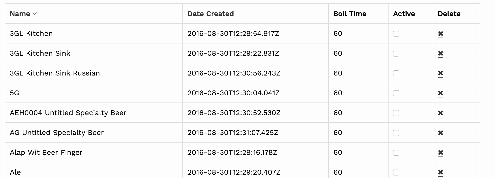

# VioletDataTable

This component displays the current page of records in a table with the columns that you specify with the `headers` property. Column headings will include sort links by default. 



To render this component, you must provide a `listId`, a `fetch` function, and an array of `headers`:

```javascript
import React, { PropTypes } from 'react'
import { connect } from 'react-redux'
import { I18n } from 'react-redux-i18n'
import { VioletDataTable } from 'violet-paginator'

import fetchRecipes from './actions'

export function Recipes({ fetch }) {
  const headers = [{
    field: 'name',
    text: I18n.t('recipes.name')
  }, {
    field: 'created_at',
    text: I18n.t('recipes.created_at')
  }, {
    field: 'boil_time',
    sortable: false,
    text: I18n.t('recipes.boil_time')
  }]

  return (
    <section>
      <VioletDataTable listId="recipes" fetch={fetch} headers={headers} />
    </section>
  )
}

export default connect(
  () => ({}),
  { fetch: fetchRecipes }
)(Recipes)
```

Optional configuration properties can be found in the [Single List Configuration](single_list_configuration.md) documentation.