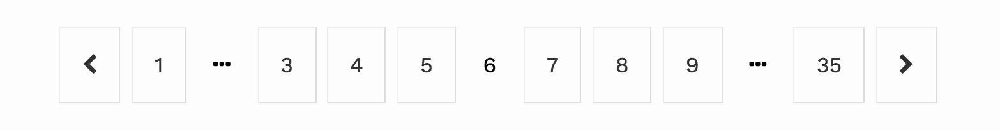

# VioletPaginator


This is a fully featured pagination component. It includes link for the previous and next page, for the first and last page, and for up to three pages on each side of the current page. The example below shows the component on page 6 of 35. 


Rendering this component requires a `fetch` function and a `listId`.

```javascript
import { connect } from 'react-redux'
import { VioletPaginator } from 'violet-paginator'
import fetchRecipes from './actions'

export function Recipes({ fetch }) {
  return (
    <section>
      <VioletPaginator listId="recipes" fetch={fetch} />
    </section>
  )
}

export default connect(
  () => ({}),
  { fetch: fetchRecipes }
)(Recipes)
```

Other optional properties are listed in the [Single List Configuration documentation](single_list_configuration.md).