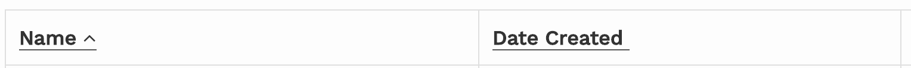

# VioletColumnHeader

By default, the component will display a button which, when clicked, will request the first page of data, sorted by the field specified by the
`field` prop. Setting `sortable={false}` on this component will cause it to display only the header text. The example below shows two sort
buttons as they would appear in the [`VioletDataTable`](violetdatatable.md) component. The arrow in the `Name` column indicates that we have
sorted the list by the `name` field in ascending order. Clicking the button would switch to descending order and flip the arrow.



## Props

Property name | Type | Description
---|:---
`listId`|`string`|The unique identifier for your paginated list, specified during [setup](create_paginator.md)
`field`|`string`|Name of the field for this column
`text`|`string`|Header display text
`sortable`|`bool` (optional)|True by default. Indicates whether the column should be sortable.

```javascript
import { VioletColumnHeader } from 'violet-paginator'

export default function TableHeader() {
  return (
    <thead>
      <tr>
        <td>
          <VioletColumnHeader listId="recipes" field="name" text="Name" />
          <VioletColumnHeader listId="recipes" field="created_at" text="Date Created" />
        </td>
      </tr>
    </thead>
  )
}
```
